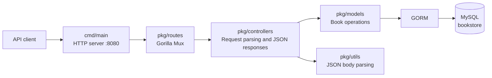

# Book Management System by Go

A Go REST API for managing a catalogue of books. The service exposes CRUD endpoints for book records and persists data in MySQL through GORM.

## Technology

| Area | Technology |
| --- | --- |
| Language | Go 1.26 |
| HTTP router | Gorilla Mux |
| ORM | GORM v1 |
| Database | MySQL |
| API style | JSON over HTTP |

## Architecture

The project follows a straightforward layered architecture. Each layer owns one responsibility and calls only the next layer in the request path.



### Request lifecycle

1. `cmd/main/main.go` creates a Gorilla Mux router and starts the HTTP server on port `8080`.
2. `pkg/routes/bookstore-route.go` maps a URL and HTTP method to the appropriate controller.
3. `pkg/controllers/book-controller.go` reads path parameters or request JSON, then serializes the result.
4. `pkg/models/book.go` performs the database operation using GORM.
5. `pkg/config/app.go` provides the MySQL connection; GORM creates or migrates the `books` table during application startup.

## Project structure

```text
.
├── cmd/main/main.go                 # Application entry point and HTTP server
├── pkg/config/app.go                # MySQL and GORM configuration
├── pkg/controllers/book-controller.go # HTTP handlers
├── pkg/models/book.go               # Book entity and database operations
├── pkg/routes/bookstore-route.go    # API route registration
├── pkg/utils/utils.go               # Request-body JSON parser
├── project-visualization.html       # Interactive architecture and API map
├── go.mod
└── README.md
```

## Prerequisites

- Go 1.26 or a compatible Go installation
- MySQL 5.7+ or MySQL 8+
- A MySQL database named `bookstore`

## Setup and run

1. Clone the repository and enter the project directory.

   ```bash
   git clone https://github.com/JeetDas5/go-bookstore.git
   cd go-bookstore
   ```

2. Create the database if it does not already exist.

   ```sql
   CREATE DATABASE bookstore CHARACTER SET utf8mb4 COLLATE utf8mb4_unicode_ci;
   ```

3. Review the connection string in `pkg/config/app.go` and replace its hard-coded MySQL credentials with credentials for your local environment. Do not use the bundled development credentials in a shared or production environment.

4. Download dependencies and start the API.

   ```bash
   go mod download
   go run ./cmd/main
   ```

5. The server starts at `http://localhost:8080`. On startup, GORM runs `AutoMigrate` for the `Book` model.

## API reference

Base URL: `http://localhost:8080`

| Method | Endpoint | Controller | Description |
| --- | --- | --- | --- |
| `POST` | `/book` | `CreateBook` | Create a book |
| `GET` | `/book` | `GetBook` | List all books |
| `GET` | `/book/{bookId}` | `GetBookById` | Get one book by ID |
| `PUT` | `/book/{bookId}` | `UpdateBook` | Update fields on an existing book |
| `DELETE` | `/book/{bookId}` | `DeleteBook` | Delete a book by ID |

### Book payload

Use this JSON object when creating or updating a book:

```json
{
  "name": "Clean Code",
  "title": "A Handbook of Agile Software Craftsmanship",
  "author": "Robert C. Martin",
  "pub": "Prentice Hall"
}
```

| Field | Type | Required on create | Notes |
| --- | --- | --- | --- |
| `name` | string | Yes | Book name |
| `title` | string | Yes | Book title or subtitle |
| `author` | string | Yes | Book author |
| `pub` | string | Yes | Publisher |

GORM also manages the record ID and timestamps. The current update handler applies only non-empty fields from the JSON body.

### Create a book

```bash
curl -X POST http://localhost:8080/book \
  -H 'Content-Type: application/json' \
  -d '{
    "name": "Clean Code",
    "title": "A Handbook of Agile Software Craftsmanship",
    "author": "Robert C. Martin",
    "pub": "Prentice Hall"
  }'
```

### List books

```bash
curl http://localhost:8080/book
```

### Get a book

```bash
curl http://localhost:8080/book/1
```

### Update a book

```bash
curl -X PUT http://localhost:8080/book/1 \
  -H 'Content-Type: application/json' \
  -d '{"pub": "Pearson"}'
```

### Delete a book

```bash
curl -X DELETE http://localhost:8080/book/1
```

## Current API behaviour

- Successful handlers return an HTTP `200 OK` response and a JSON response body.
- The current code does not return structured error responses for invalid IDs, missing records, invalid JSON, or database failures.
- The `GET`, `PUT`, and `DELETE` handlers currently set `Content-Type` to `pkglication/json`; this should be corrected to `application/json` before client integration.

## Interactive project map

Open `project-visualization.html` in a browser to explore the architecture and select an API endpoint to follow its request flow.

## Repository

Source code and issues: [github.com/JeetDas5/go-bookstore](https://github.com/JeetDas5/go-bookstore)
